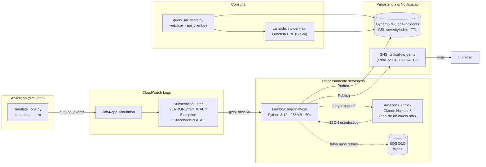

# Sistema de Observabilidade com IA


**Capstone** da trilha de estudos de **AWS AI Services**. Um pipeline serverless e
orientado a eventos que detecta erros em logs, usa o **Amazon Bedrock (Claude Haiku)**
para analisar a **causa raiz**, persiste o incidente no **DynamoDB**, **notifica** via
**SNS** quando crítico e expõe uma **API REST** para consulta.

> CloudWatch detecta erros → Lambda analisa com Bedrock → DynamoDB persiste → SNS notifica → API consulta.

---

## 🏗️ Arquitetura



### Fluxo
1. `simulate_logs.py` envia logs de erro realistas para o log group `/lab4/app-simulation`.
2. O **Subscription Filter** captura linhas com `ERROR/CRITICAL/Exception/Traceback/FATAL`
   e invoca o **Lambda analyzer** (payload gzip+base64).
3. O analyzer chama o **Bedrock (Claude Haiku)** com retry e backoff exponencial,
   recebendo uma análise estruturada em JSON (severidade, causa raiz, ações, confiança).
4. O incidente é persistido no **DynamoDB** com as chaves do GSI `severityIndex` e TTL.
5. Se a severidade for **CRITICO** ou **ALTO**, uma notificação é publicada no **SNS**.
6. Os incidentes podem ser consultados via **CLI** (DynamoDB direto) ou pela **API HTTP** (Function URL assinada com SigV4).

---

## 📂 Estrutura do projeto

```
observabilidade-ia-aws/
├── terraform/              # IaC: CloudWatch, Lambda, DynamoDB, SNS, SQS, IAM
├── lambda/
│   ├── analyzer/handler.py # Analise com Bedrock + persistencia + notificacao
│   └── api/handler.py      # API REST de incidentes (Function URL)
├── src/
│   ├── simulate_logs.py    # Gera e envia logs de erro realistas
│   ├── query_incidents.py  # CLI de consulta (lista, filtra, stats)
│   ├── watch.py            # Monitor em tempo real (Rich)
│   ├── api_client.py       # Cliente HTTP assinado (SigV4)
│   ├── scenarios.py        # Cenarios de erro
│   └── common.py           # Config compartilhada
├── backend/server.py       # Proxy FastAPI (assina SigV4 p/ o front)
├── frontend/               # Dashboard React + Vite
│   └── src/
│       ├── App.jsx         # Pagina principal (auto-refresh, filtros)
│       └── components/     # StatsCards, SeverityChart, IncidentTable, Modal
├── tests/test_e2e.py       # Teste end-to-end do pipeline
├── Makefile                # Atalhos de operacao
└── requirements.txt
```

---

## 🚀 Demo — passo a passo

### Pré-requisitos
- Credenciais AWS configuradas com acesso a Bedrock, Lambda, DynamoDB, SNS, CloudWatch, SQS, IAM.
- Acesso ao modelo **Claude Haiku** habilitado no Bedrock (região `us-west-2`).
- Terraform >= 1.5, Python 3.12.

### 1. Configurar
```bash
# Dependencias locais (em venv)
python3 -m venv .venv && . .venv/bin/activate
make deps

# E-mail de notificacao
cp terraform/terraform.tfvars.example terraform/terraform.tfvars
# edite notification_email
```

### 2. Provisionar a infraestrutura
```bash
make tf-apply
# Confirme a inscricao do SNS no e-mail recebido (necessario para notificacoes).
```

### 3. Disparar o pipeline
```bash
make simulate S=db-connection-failure   # um cenario especifico
make simulate-random COUNT=5            # cenarios aleatorios
make scenarios                          # lista os cenarios disponiveis
```

Cenários disponíveis: `db-connection-failure`, `memory-leak`, `disk-full`,
`auth-failure`, `network-timeout`.

### 4. Consultar incidentes
```bash
make incidents                # lista recentes (DynamoDB)
make stats                    # estatisticas agregadas
make watch                    # monitor em tempo real
make api P=/stats             # via API HTTP assinada (SigV4)
make api P=/incidents?severity=CRITICO
```

### 5. Teste end-to-end
```bash
make test-e2e
# -> E2E test passed — incident <id> created with severity CRITICO
```

### 6. Destruir
```bash
make tf-destroy
```

---

## 📋 Saída de exemplo (`make incidents` — output real)

```
=== 4 incidente(s) mais recente(s) ===

 CRITICO   2026-06-18 02:20:51  conf=98%  Particao /var/data saturada (100%) - falha de gravacao de relatorios
          id: e1d4a8ef-e7fa-4793-975f-17332ad164a9  | DISCO | relatorios-worker
          causa: A particao /var/data atingiu 100% de capacidade (500GB/500GB), impedindo
                 a gravacao de arquivos de relatorio e falha do logrotate. (...)

 CRITICO   2026-06-18 02:20:50  conf=95%  Falha em cascata de autenticacao por desincronizacao de chaves JWT
          id: b7a03493-3bd6-4774-a684-9be27f0cc956  | AUTENTICACAO | auth-gateway (TokenValidator)
          causa: Rotacao de chave de assinatura JWT nao propagada para todas as instancias (...)

 CRITICO   2026-06-18 02:20:48  conf=95%  Esgotamento de heap memory na API de checkout com GC overhead
          id: 21db39a7-b28c-4262-ac6a-8f2ce53034cf  | MEMORIA | checkout-api - SessionCache
          causa: Vazamento de memoria ou crescimento descontrolado de objetos no cache (...)

 CRITICO   2026-06-18 02:20:31  conf=95%  Indisponibilidade do banco PostgreSQL - pool de conexoes esgotado
          id: 5bc405cb-e467-4333-a366-e0c67b835556  | BANCO_DADOS | pedidos-service
          causa: O servidor PostgreSQL (db-prod.internal:5432) esta inacessivel ou recusando (...)
```

### Incidente completo (JSON da API)

```json
{
  "incidentId": "e1d4a8ef-e7fa-4793-975f-17332ad164a9",
  "severity": "CRITICO",
  "titulo": "Particao /var/data saturada (100%) - falha de gravacao de relatorios",
  "categoria": "DISCO",
  "componenteAfetado": "relatorios-worker",
  "causaRaiz": "A particao /var/data atingiu 100% de capacidade (500GB/500GB), impedindo a gravacao de arquivos de relatorio e falha do logrotate. O acumulo de dados sem limpeza adequada saturou o espaco, causando falha em cascata nos processos de persistencia.",
  "impacto": "Indisponibilidade total do servico de geracao de relatorios; fila acumulando; impossibilidade de persistir dados criticos.",
  "acoesRecomendadas": [
    "Liberar espaco em disco: remover/arquivar arquivos antigos em /var/data/reports",
    "Aumentar capacidade da particao ou adicionar novo volume",
    "Revisar politica de retencao e implementar limpeza automatica",
    "Configurar alerta quando disco atingir 80% de uso",
    "Executar logrotate manualmente apos liberar espaco"
  ],
  "confianca": 0.98,
  "logGroup": "/lab4/app-simulation",
  "timestamp": "2026-06-18T02:20:51Z"
}
```

### `make stats` (output real)
```json
{
  "total": 4,
  "by_severity": { "ALTO": 0, "BAIXO": 0, "CRITICO": 4, "MEDIO": 0 },
  "avg_confidence": 0.958,
  "last_24h": 4
}
```

---

## 🌐 API REST (Lambda Function URL)

| Rota | Descrição |
|------|-----------|
| `GET /incidents` | Últimos 20 incidentes (ordenados por timestamp desc) |
| `GET /incidents?severity=CRITICO` | Filtra por severidade usando o GSI `severityIndex` |
| `GET /incidents/{id}` | Detalhes de um incidente |
| `GET /stats` | `{total, by_severity, avg_confidence, last_24h}` |

> **Autenticação:** a Function URL usa `AWS_IAM` (requisições assinadas com SigV4).
> Optamos por IAM em vez de `NONE` porque muitas contas corporativas bloqueiam
> Function URLs públicas via SCP. Use `src/api_client.py` (ou `make api P=/stats`),
> que assina automaticamente com as credenciais locais. Para tornar a API pública,
> defina `api_auth_type = "NONE"` no `terraform.tfvars`.

---

## 🖥️ Dashboard web (React + Vite)

Um dashboard de observabilidade que consome a API e exibe os incidentes em tempo
real: cartões de resumo, tabela filtrável por severidade, gráfico de distribuição
e modal de detalhes (causa raiz, impacto e ações recomendadas).

```
React (Vite :5173) ──/api/*──► Proxy FastAPI (:8000) ──SigV4──► Lambda Function URL ──► DynamoDB
```

Como o navegador não assina requisições SigV4, um pequeno **proxy FastAPI**
(`backend/server.py`) roda localmente, usa as credenciais AWS da máquina para
assinar e encaminha as chamadas — sem expor credenciais no browser e sem CORS.

```bash
make web-install        # instala dependencias do front (npm) — uma vez
make dashboard          # sobe proxy + React juntos -> http://localhost:5173
# (ou, separadamente: 'make proxy' em um terminal e 'make web' em outro)
```

Funcionalidades do dashboard:
- **Auto-refresh** a cada 10s com indicador "● ao vivo" (pausável).
- **Filtros** por severidade (usam o GSI no backend).
- **Modal** com o detalhamento completo da análise da IA.
- **Gráfico** de incidentes por severidade (recharts).

---

## 💰 Estimativa de custo

Custos para uso típico de lab/portfólio (região `us-west-2`, preços de referência).
**Por incidente processado** (~1 invocação completa do pipeline):

| Serviço | Uso por incidente | Custo aprox. |
|---------|-------------------|--------------|
| **Bedrock** (Claude Haiku) | ~600 tokens in + ~400 out | ~US$ 0,0003–0,0005 |
| **Lambda** analyzer | 256MB × ~3s | ~US$ 0,00002 |
| **DynamoDB** (on-demand) | 1 escrita + leituras de consulta | ~US$ 0,000002 |
| **SNS** | 1 e-mail (se CRITICO/ALTO) | ~US$ 0,000002 |
| **CloudWatch Logs** | ingestão/armazenamento mínimo | ~US$ 0,000005 |
| **Total por incidente** | | **≈ US$ 0,0005** |

| Item fixo / mensal | Custo aprox. |
|--------------------|--------------|
| DynamoDB on-demand (idle) | ~US$ 0 (paga por uso; TTL limpa dados) |
| CloudWatch Logs (retenção 7 dias) | centavos |
| Lambda/SNS/SQS (idle) | US$ 0 |

➡️ **~1.000 incidentes ≈ US$ 0,50.** O TTL (30 dias) e a retenção curta de logs
mantêm o custo de armazenamento próximo de zero. **Lembre de rodar `make tf-destroy`**
ao terminar.

---

## 🧠 Decisões de engenharia

- **Orientado a eventos**: Subscription Filter invoca o Lambda sem polling.
- **Resiliência**: 3 tentativas com backoff exponencial no Bedrock; **DLQ (SQS)** para eventos que falham.
- **Saída estruturada da IA**: prompt força JSON com schema fixo (severidade, causa raiz, ações, confiança).
- **Consultas eficientes**: GSI `severityIndex` (severity + timestamp) para filtrar por severidade sem `scan`.
- **Logs estruturados (JSON)**: prontos para CloudWatch Logs Insights.
- **Controle de custo**: DynamoDB on-demand, TTL nos incidentes, retenção curta de logs.
- **Segurança**: IAM com permissões mínimas por Lambda; Function URL com SigV4.

---

## 🎯 Skills demonstradas

- **Arquitetura orientada a eventos** — CloudWatch Subscription Filter → Lambda.
- **Serverless** — Lambda, Function URL, DynamoDB on-demand, SNS, SQS (sem servidores).
- **Integração com IA** — Amazon Bedrock (Claude Haiku) para análise de causa raiz com saída estruturada.
- **Observabilidade** — detecção de erros, classificação de severidade, logs estruturados, métricas.
- **Infraestrutura como Código (IaC)** — Terraform modular (16 recursos), IAM least-privilege.
- **Python** — Lambdas, CLIs, cliente HTTP assinado (SigV4), testes E2E, Rich.
- **Full-stack / Front-end** — dashboard React (Vite) + proxy FastAPI; consumo de API, gráficos e estado em tempo real.

---

## 🔧 Variáveis do Terraform

| Variável | Padrão | Descrição |
|----------|--------|-----------|
| `notification_email` | — (obrigatório) | E-mail para notificações SNS |
| `aws_region` | `us-west-2` | Região AWS |
| `bedrock_model_id` | `us.anthropic.claude-haiku-4-5-20251001-v1:0` | Modelo Bedrock |
| `api_auth_type` | `AWS_IAM` | `AWS_IAM` (SigV4) ou `NONE` (público) |
| `criar_api` | `true` | Cria o Lambda da API |
| `ttl_dias` | `30` | TTL dos incidentes |
| `log_retention_dias` | `7` | Retenção dos logs |

---

## 📖 Documentação

Documentação detalhada na pasta [`docs/`](docs/):

- **[Arquitetura](docs/ARQUITETURA.md)** — componentes, fluxo de dados, modelo de
  dados, segurança, resiliência e decisões de projeto.
- **[Runbook](docs/RUNBOOK.md)** — procedimentos operacionais, health checks e
  troubleshooting.
- **[Variáveis de Ambiente](docs/VARIAVEIS-AMBIENTE.md)** — template completo de
  configuração (`.env`, `terraform.tfvars`, vars dos Lambdas).

---

## 📚 Contexto

Projeto **capstone** da trilha de estudos de AWS AI Services. Demonstra um sistema
de observabilidade orientado a eventos, do log cru à análise por IA, persistência,
notificação e visualização — ponta a ponta, com infraestrutura descartável (`make tf-destroy`).
