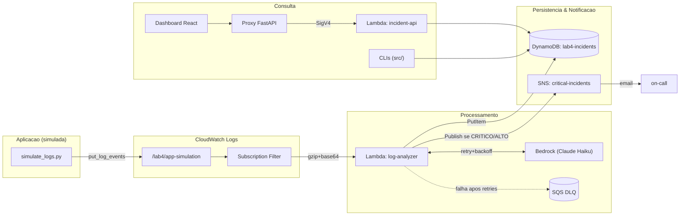

# Documentação de Arquitetura

Sistema de Observabilidade com IA — detalhamento técnico da arquitetura, dos
componentes, do fluxo de dados e das decisões de projeto.

---

## 1. Visão geral

O sistema é um pipeline **serverless** e **orientado a eventos** que transforma
logs de erro brutos em **incidentes analisados por IA**. Não há servidores para
gerenciar: cada componente é acionado por um evento e cobra-se apenas pelo uso.

---

## 2. Componentes

### 2.1 CloudWatch Logs — ingestão
- **Log group:** `/lab4/app-simulation` (retenção de 7 dias).
- Recebe os eventos de erro. Em produção, seria a sua aplicação real escrevendo aqui.
- **Subscription Filter** com o padrão `?ERROR ?CRITICAL ?Exception ?Traceback ?FATAL`
  (lógica OR): qualquer linha que contenha um desses termos dispara o Lambda.
- O CloudWatch entrega o payload **comprimido (gzip) e codificado em base64**.

### 2.2 Lambda `log-analyzer` — o cérebro
- **Runtime:** Python 3.12 · **Memória:** 256 MB · **Timeout:** 60 s.
- Responsabilidades:
  1. **Decodificar** o payload (base64 → gzip → JSON).
  2. **Montar o prompt** e chamar o **Bedrock** com retry e backoff exponencial.
  3. **Parsear** a resposta JSON estruturada da IA.
  4. **Persistir** o incidente no DynamoDB (com chaves do GSI e TTL).
  5. **Notificar** via SNS se a severidade for `CRITICO` ou `ALTO`.
- **Dead Letter Queue (SQS):** eventos que falham após todos os retries são
  enviados para a DLQ, evitando perda silenciosa.
- **Logs estruturados (JSON):** cada linha é um objeto JSON, pronto para
  CloudWatch Logs Insights.

### 2.3 Amazon Bedrock — análise de causa raiz
- **Modelo:** `us.anthropic.claude-haiku-4-5-20251001-v1:0` (inference profile).
- **Por que Haiku:** baixo custo e baixa latência, suficiente para classificação
  e análise de causa raiz de logs.
- O prompt **força saída JSON** com schema fixo (título, severidade, categoria,
  causa raiz, componente, ações, impacto, confiança), com `temperature` baixa
  (0.2) para respostas determinísticas.

### 2.4 DynamoDB — persistência
- **Tabela:** `lab4-incidents` · **Billing:** on-demand (`PAY_PER_REQUEST`).
- **Chave primária (HASH):** `incidentId` (UUID).
- **GSI `severityIndex`:** HASH = `severity`, RANGE = `timestamp` —
  permite consultar "todos os CRÍTICOS, mais recentes primeiro" sem `scan`.
- **TTL:** atributo `ttl` (epoch) expira incidentes após 30 dias automaticamente.

### 2.5 SNS — notificação
- **Tópico:** `lab4-critical-incidents` com inscrição por e-mail.
- Publica somente para severidades `CRITICO`/`ALTO` (reduz ruído).
- A inscrição por e-mail exige **confirmação manual** (link enviado pela AWS).

### 2.6 Lambda `incident-api` — API REST
- Exposta via **Lambda Function URL** (sem API Gateway).
- **Autenticação:** `AWS_IAM` (requisições assinadas com SigV4).
- Rotas: `GET /incidents`, `GET /incidents?severity=`, `GET /incidents/{id}`, `GET /stats`.

### 2.7 Camada de visualização
- **`backend/server.py` (proxy FastAPI):** roda localmente, assina as chamadas
  com SigV4 usando as credenciais da máquina e encaminha para a Function URL.
  Resolve o fato de o navegador não conseguir assinar SigV4.
- **`frontend/` (React + Vite):** dashboard com cartões, tabela filtrável,
  gráfico (recharts) e modal de detalhes; auto-refresh a cada 10 s.
- **`src/` (CLIs):** `query_incidents.py`, `watch.py` e `api_client.py` —
  acessam o DynamoDB diretamente ou via API.

---

## 3. Fluxo de dados (passo a passo)

1. Um erro é escrito no log group `/lab4/app-simulation`.
2. O **Subscription Filter** casa o padrão e invoca o Lambda `log-analyzer`,
   passando os eventos comprimidos.
3. O Lambda decodifica, monta o prompt e chama o **Bedrock**.
   - Em caso de falha (throttling, timeout), tenta novamente até 3x com backoff
     exponencial (2 s, 4 s, 8 s).
4. A resposta JSON da IA é parseada e validada.
5. Um item de incidente é gravado no **DynamoDB**, incluindo `severity` e
   `timestamp` (chaves do GSI) e `ttl`.
6. Se `severity ∈ {CRITICO, ALTO}`, uma mensagem é publicada no **SNS**.
7. Se o Bedrock falhou em todas as tentativas, o evento vai para a **DLQ**.
8. A consulta ocorre por **API** (dashboard/proxy) ou **CLI** (DynamoDB direto).

---

## 4. Modelo de dados (item do DynamoDB)

| Atributo | Tipo | Descrição |
|----------|------|-----------|
| `incidentId` | String (PK) | UUID do incidente |
| `severity` | String (GSI HASH) | `CRITICO` / `ALTO` / `MEDIO` / `BAIXO` |
| `timestamp` | String (GSI RANGE) | ISO-8601 da detecção |
| `titulo` | String | Resumo curto |
| `categoria` | String | `BANCO_DADOS`, `MEMORIA`, `DISCO`, `AUTENTICACAO`, `REDE`, `APLICACAO`, `OUTRO` |
| `causaRaiz` | String | Explicação técnica da causa provável |
| `componenteAfetado` | String | Serviço/componente impactado |
| `acoesRecomendadas` | List | Lista de ações sugeridas (runbook) |
| `impacto` | String | Impacto no usuário/negócio |
| `confianca` | Number (Decimal) | Confiança da IA (0.0–1.0) |
| `logGroup` | String | Origem do log |
| `logTrecho` | String | Trecho do log analisado (até 4000 chars) |
| `criadoEm` | String | ISO-8601 de criação |
| `ttl` | Number | Epoch de expiração (30 dias) |

---

## 5. Segurança

- **IAM least-privilege:** cada Lambda tem um papel próprio com o mínimo necessário.
  - `analyzer`: `bedrock:InvokeModel`, `dynamodb:PutItem/Query/GetItem`,
    `sns:Publish`, `sqs:SendMessage` (DLQ), `logs:*`.
  - `api`: somente `dynamodb:Scan/Query/GetItem` e `logs:*`.
- **Function URL com SigV4 (`AWS_IAM`):** evita exposição pública. (Configurável
  para `NONE` se a conta permitir Function URLs públicas.)
- **Sem segredos no código:** credenciais via cadeia padrão do AWS SDK; `.env`,
  `.tfvars` e estado do Terraform fora do versionamento.
- **Escopo dos ARNs:** políticas restritas à tabela, índice, tópico e fila do projeto.

---

## 6. Resiliência e tratamento de erros

| Mecanismo | Proteção contra |
|-----------|------------------|
| Retry + backoff exponencial (3x) no Bedrock | Throttling/timeouts transitórios da API |
| Dead Letter Queue (SQS, 14 dias) | Perda silenciosa de eventos que falham |
| Parser tolerante (cercas de código, JSON parcial) | Variações de formatação na resposta da IA |
| `temperature` baixa + schema fixo | Saídas inconsistentes da IA |
| Timeout de 60 s no Lambda | Travamentos em chamadas externas |

---

## 7. Decisões de projeto (trade-offs)

| Decisão | Alternativa | Por que escolhemos |
|---------|-------------|--------------------|
| **Lambda Function URL** | API Gateway | Menos componentes e custo; suficiente para o escopo |
| **Function URL com SigV4** | Auth pública (`NONE`) | Mais seguro; contorna SCP que bloqueia URLs públicas |
| **DynamoDB on-demand** | Provisioned | Carga imprevisível de lab; paga por uso, idle ≈ US$ 0 |
| **GSI `severityIndex`** | `scan` + filtro | Consulta eficiente por severidade, sem varrer a tabela |
| **Claude Haiku** | Modelos maiores (Sonnet/Opus) | Custo/latência baixos, qualidade suficiente p/ triagem |
| **Proxy FastAPI local** | Cognito / Amplify | Simplicidade; o navegador não assina SigV4 sozinho |
| **TTL no DynamoDB** | Limpeza manual | Controle de custo automático |

---

## 8. Escalabilidade e limites

- **Concorrência:** cada batch de logs invoca uma instância do Lambda; o Lambda
  escala horizontalmente de forma automática (sujeito ao limite de concorrência da conta).
- **Throughput do Bedrock:** sujeito a cotas por modelo/região; o retry com
  backoff absorve throttling pontual.
- **DynamoDB on-demand:** escala automaticamente; sem capacidade a provisionar.
- **Gargalo prático:** cota de TPS do Bedrock em picos altos de erros — mitigável
  com fila intermediária (SQS) entre o filtro e o analyzer, se necessário.

---

## 9. Evoluções possíveis

- **SQS entre o Subscription Filter e o analyzer** para amortecer picos.
- **Deduplicação** de incidentes recorrentes (hash do trecho de log).
- **Métricas customizadas** no CloudWatch (incidentes por categoria/severidade).
- **Hospedar o front** (S3 + CloudFront) e trocar o proxy por Cognito.
- **Integração com PagerDuty/Slack** além do e-mail no SNS.

---

Ver também: [RUNBOOK.md](RUNBOOK.md) · [VARIAVEIS-AMBIENTE.md](VARIAVEIS-AMBIENTE.md) · [../README.md](../README.md)
